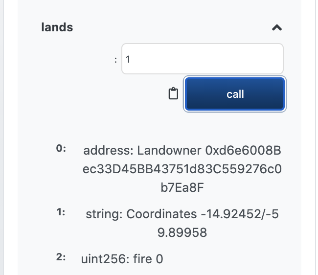

# RAIN Will Stop the Fires
# Crypto Conservation: Preventing Amazon Deforestation Utilizing Blockchain
 
The inspiration for this project was the notion that the theory of tokenomics could be used to promote positive behavior in the real world. We wanted to see if tokenomics could be applied to the problem of landowners in Brazil burning the Amazon Rainforest for economic gains. While this behavior is advantageous to the individual landowner and the government of Brazil, the destruction of the Amazon Rainforest is detrimental to the rest of the world. NASA satellites monitoring the earth are able to detect if certain latitude and longitude coordinates in the Amazon Rainforest are currently showing signs of being on fire. If we could tie that data to landowners' plots of land we could incentivize the landowners to maintain the rainforest by paying them more than they would get if the burned their land and changed it to agricultural land.
 
## Applicable Blockchain Pillars
 
Blockchain is a appropriate technology to use for this project because of a few of its attributes:
- Blockchain is Borderless
   - Donors from around the world can subsidize these landowners and have a direct impact on saving the rainforest
- Blockchain is Censor Resistant and Public
   - If the government of Brazil believes that it is in the national interest to burn the rainforest to facilitate agricultural use, they may prevent other organizations from operating in the country; however, they would not be able to stop the direct payments this project is proposing
- Blockchain is Immutable
   - The record of fires at certain coordinates are recorded permanently and that plot of land cannot receive payments again, modeling the real life circumstances that the rainforest is permanently removed by fire
 
## Implementation
 
We created two contracts in Solidity. The first contract controls our fundraising efforts and the second controls our land registry, coin issuance, reporting and payouts. Following are the instructions for using each of the contracts.

(Use the files contained in the Contracts folder)
 
### Fundraising.sol
 
1. Open the Fundraiser.sol file in Remix and compile the Solidity code.
 

 
2. Enter the beneficiary address and deploy the compiled Fundraiser contract.
 

 
3. Once deployed, the Fundraiser contract allows the donor to donate ETH to the beneficiary address and view the volume and value of total donations by pressing the buttons.
 

 
### LandFax.sol
 
1. Open the LandFax.sol file in Remix, compile the code and deploy the contract.
 

 
2. Once deployed, landowners in the Amazon Rainforest can register their plots of land using the registerLand function, which requires the user to enter their address for receiving ether and the coordinates of their land.
 

 
3. The landowner’s address, latitude/longitude coordinates and whether they have had a fire on their land has been permanently associated to token 1.
 

 
4. The token assigned to the landowner is associated with their address.
 

 
5. If it is detected that the plot of land has a fire, the reportFire function can be utilized to emit the event to the blockchain.
 

 
6. Token_id 1 will report that the plot of land at the landowner’s coordinates has had a fire and they will no longer be eligible to receive payments through the program.
 

 
7. The final step is paying the landowners who have not had a fire on their land using the pay function.  The pay function requires the amount of the payment, the landowners’ token ID and whether they have had a fire on their land. If the boolean is true, they will not be paid. If the boolean is false, they will be paid.
 

 
## Issues and Next Steps
 
- We created a python file to interact with our LandFax.sol contract (included in the repo), but the "get" function wouldn't work
 
- We want to use a web3 filter in the python code to interact with our payment function
 
- We want the NASA data to downloaded automatically to interact with our contracts
 
- We would like to automate the process and remove any manual actions so that the landowners are paid automatically if they don't have a fire and are removed from the payment list is a fire is reported 

